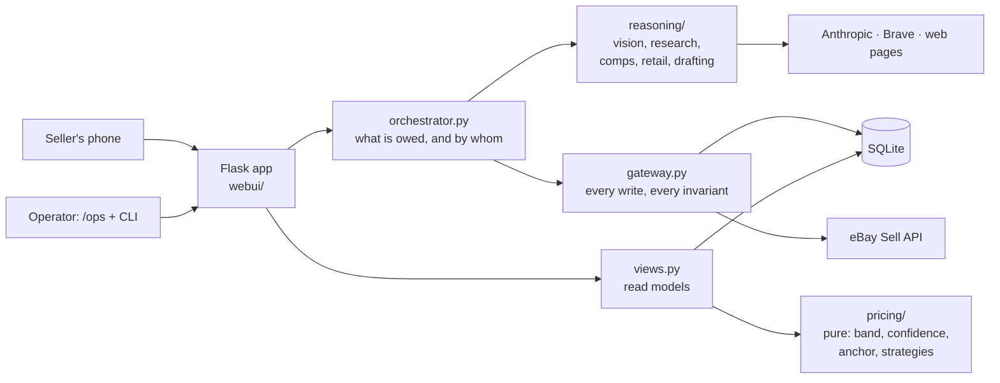

# resell

A personal reselling agent. Photographs and a purchase price go in; a
researched, priced, published eBay listing comes out.

You point a phone at something in a cupboard. The agent works out what it is,
finds what comparable ones sell for, works out what it costs new, writes the
listing, and proposes three prices. You approve the price and the listing. It
publishes.

**Current state:** running a private beta with a handful of invited users against
the **eBay Sandbox**, on one seller account. Nothing here touches real money.

## Contents

| | |
|---|---|
| [docs/ARCHITECTURE.md](docs/ARCHITECTURE.md) | Diagrams, module map, data model, what is persisted |
| [docs/PRICING.md](docs/PRICING.md) | Evidence types, confidence, the retail anchor, the three strategies |
| [docs/RESEARCH.md](docs/RESEARCH.md) | Identification, comp research, retail research, judging, budgets |
| [docs/DECISIONS.md](docs/DECISIONS.md) | Invariants, non-obvious choices, failures worth not repeating |
| [deploy/beta.md](deploy/beta.md) | The private-beta deployment runbook |

## The idea in one paragraph

Two planes, kept apart. **The reasoning plane proposes** — it calls models, reads
pages, extracts claims, judges comparability, and is assumed to be wrong
sometimes. **The gateway and state machine accept** — every write goes through
`src/resell/gateway.py`, which refuses anything violating an invariant. The agent
may believe nothing it cannot cite: every claim traces to a row in `evidence`
recording what was seen, where, and on what basis. Where the evidence genuinely
does not settle something, the agent asks a person rather than guessing.

## Architecture at a glance



The fuller version, including the agent loop and the data model, is in
[docs/ARCHITECTURE.md](docs/ARCHITECTURE.md).

## Workflow

The orchestrator owns the sequence. `next_step()` is a read-only function of the
record — given an item it says what is owed and who owes it — and `advance()`
runs agent steps until a person is needed.

```
attach photos
  observe → suggest category → research identity → map aspects → grade condition
  [ask the operator, only when the evidence genuinely does not settle it]
  draft → [confirm identity, only when it was never resolved]
pricing
  comp research: plan → search → fetch → extract → judge → claim   (repeats)
  retail research: one targeted query → validate → judge           (once)
  → approve price          ← operator
propose listing
  → approve listing        ← operator
  → publish                ← operator
```

Four of those arrows are the operator's, and they are the only four. Everything
else is the agent talking to itself.

## Setup

### 1. eBay developer portal

1. Sign in at <https://developer.ebay.com/my/keys>. You need the **Sandbox**
   keyset — App ID (client ID) and Cert ID (client secret).
2. Click **User Tokens** next to the sandbox Client ID and create an **RuName**.
   The Auth Accepted URL must be `https` and never has to work: the login flow
   reads the code out of your address bar, so `https://localhost/accept` is fine
   and a page that fails to load is the expected outcome.
3. Copy the **RuName** itself — `Jane_Doe-JaneDoe-myapp-abcdefgh`. It is *not*
   the accept URL. eBay's `redirect_uri` takes this token, and confusing the two
   is the single most common way this flow goes wrong.
4. Create a sandbox **test seller** at
   <https://developer.ebay.com/sandbox/register>. You sign in as this user during
   consent, not as your developer account.

### 2. Local

```bash
uv sync
```

Then `cp .env.example .env` and fill in the four `EBAY_*` values. For the agent
to do any reasoning you also need `ANTHROPIC_API_KEY`, and for autonomous
research `BRAVE_API_KEY` with `RESELL_SEARCH_BACKEND=brave`.

### 3. Authorize

```bash
uv run resell auth login
```

Opens the consent page; you sign in as the sandbox test seller, click **Agree and
Continue**, land on your (probably broken) accept URL, and paste the whole
address-bar URL back into the prompt. The authorization code is single-use and
lives about five minutes.

### 4. Verify

```bash
uv run resell smoke
```

Three read-only checks — `getPrivileges`, `getInventoryLocations` and
`getDefaultCategoryTreeId` — proving consent, the listing scope and the
application-token path. Empty results are passes; what matters is that calls
authorize rather than 403. Failures are classified: `AUTH`/`SCOPE`/`ERROR` block
progress, `SETUP` and `SANDBOX` do not.

### 5. Provision the sandbox seller

```bash
uv run resell account provision
```

Idempotently ensures the four things `publishOffer` requires: payment, return and
fulfillment policies, plus one merchant inventory location. A new sandbox seller
is not enrolled in business policies — the symptom is error 20403 — so run
`uv run resell account optin` first if needed.

## Running it

```bash
uv run resell ui
```

Serves on `http://127.0.0.1:5000`. Flask is an optional extra
(`uv pip install 'resell[ui]'`); the beta host also needs `waitress`
(`uv sync --extra beta`) and runs `resell ui --production`.

**Every route needs an authenticated identity.** In the beta that arrives in a
Cloudflare Access header; running locally there is none, so set `RESELL_DEV_EMAIL`
in `.env` or every request answers 403. Add the same address to
`RESELL_ADMIN_EMAILS` to reach `/ops`, which is operator-only and checked in the
app rather than only at the edge.

Never set `RESELL_DEV_EMAIL` on a host serving the beta: with it set, anyone who
reaches the port is that person.

## Two front ends, one workflow

`/` is the seller's. `/ops` is the operator's, and the place to diagnose an item.

The consumer screens are **GET-only projections**. `views_consumer.py` builds
`TaskView` and `ShelfRow` from the `WorkflowView` and `InventoryRow` the operator
UI already builds — no queries, no `next_step`, no decisions. Every action on a
consumer screen posts to the endpoint the operator UI posts to, so there is one
orchestrator, one set of approval seams, one set of safety checks. Two screens
showing different words is a product choice; two screens computing different
answers is a second workflow, and the second one is always subtly wrong.

What the seller does not see: orchestrator steps, SKUs, states, evidence,
citations, comparables, categories, budgets, or what the agent cost to run. What
they do see is the one thing being asked of them.

## The CLI

The CLI is the reference front end and drives the same gateway.

```bash
uv run resell item create --cost-cents 2500 --intent resale
uv run resell item photos MP-000001 photos/*.jpg
uv run resell item advance MP-000001      # run agent steps until a person is needed
uv run resell item show MP-000001
uv run resell price recommend MP-000001 --condition-band used_good \
    --identity-resolution searched_not_found
uv run resell item publish MP-000001 --dry-run
uv run resell events -n 20                # what actually happened
```

Nine groups: `auth`, `account`, `item`, `db`, `price`, `ui`, `images`, `smoke`,
`events`. `uv run resell <group> --help` lists most of them; `db` and `price`
attach their subparsers differently and reject `--help` at the group level, so
list those with `uv run resell db` and `uv run resell price` and pass `--help` to
a subcommand.

## Tests

```bash
uv run pytest
```

**1608 tests, no network and no credentials needed.** A session-wide fixture
replaces the model adapter registry with one that raises, so a test cannot make a
paid API call by accident.

Two checks are not part of the suite because they cost a model call and go to the
live web:

```bash
uv run python scripts/rejudge_mp000047.py    # re-measure the comp judge
uv run python scripts/check_docs.py          # diagrams, paths and links in the docs
```

`rejudge_mp000047.py` exists because prompt behaviour has twice been "verified" by
asserting the prompt's own wording while the live judge did the opposite. What a
prompt does is measured, and the measurement is recorded in the test file.

## Layering

Pure logic, then persistence, then network, then transport. `src/resell/pricing/`
has no database and no network at all, which is why a price can be reproduced
from stored rows months later, and why the whole suite runs offline.

## Known limits

- **Sandbox only.** Production works (`EBAY_ENV=production`) but needs separate
  keysets *and* a separate RuName. Treat "works in sandbox" as directional.
- **The retention table is opinion, not measurement.** It has no `Health &
  Beauty` row, so massagers use the default rate.
- **Raw search results are not persisted.** `research_lookup` records the query
  and a result count, not the URLs, so anything rejected before extraction leaves
  no trace it was seen.
- **Prompt text is stored as a hash.** A change is detectable; the old text is
  not recoverable.
- **JS-rendered shop pages are invisible.** Retail extraction reads
  server-rendered HTML only.
- **Cloudflare JWT verification is deferred** and is a precondition for
  production eBay or a wider invite list. See [deploy/beta.md](deploy/beta.md).
