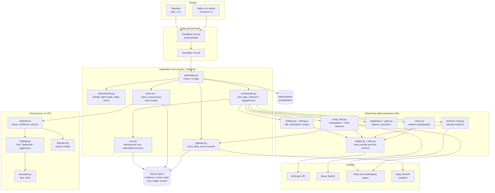
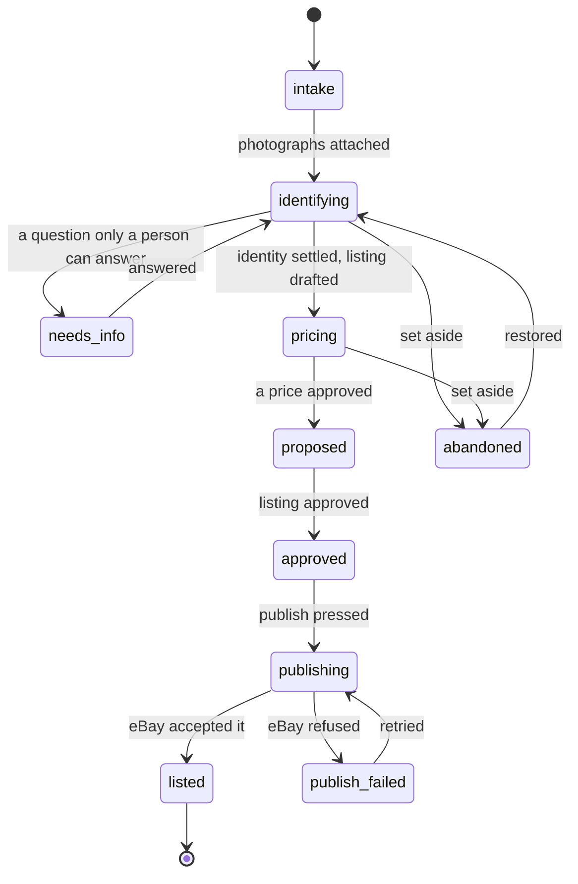
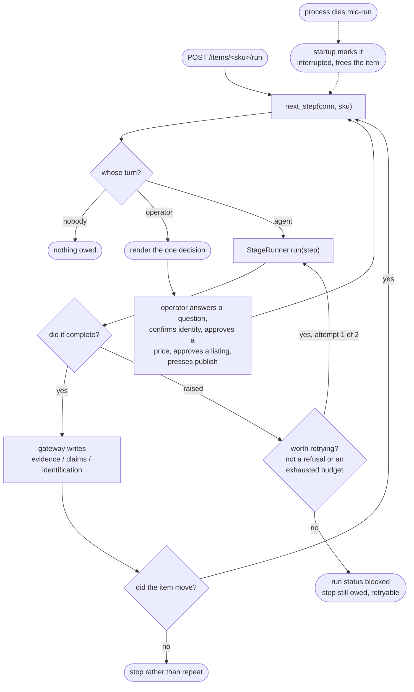
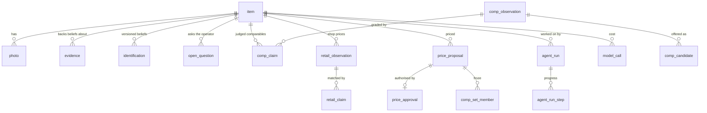

# Architecture

How the pieces fit and where data goes. Written for somebody who did not build
this. For the pricing model in depth see [PRICING.md](PRICING.md); for how
evidence is gathered and judged see [RESEARCH.md](RESEARCH.md); for why several
non-obvious choices are what they are see [DECISIONS.md](DECISIONS.md).

## The shape of the thing

Photographs and a purchase price go in. A researched, priced, published eBay
listing comes out. Between those two points sit two planes that are kept
deliberately apart:

- **The reasoning plane** proposes. It calls models, reads web pages, extracts
  claims, judges comparability. It may be wrong, and it is assumed to be.
- **The gateway and state machine accept.** Every write goes through
  `src/resell/gateway.py`, which refuses anything that violates an invariant.
  A model cannot skip a state, publish without an approval, or cite evidence
  that does not exist.

Everything the agent believes is backed by a row in `evidence` that says where
the belief came from. That is the single rule the rest of the design follows
from.

## A. System architecture

Three things a newcomer should take from this:

1. **Everything funnels through the gateway.** The reasoning plane never writes.
2. **Pricing is pure.** `src/resell/pricing/` has no database and no network. It
   takes a `PricingInput` and returns a recommendation, which makes it testable
   without a fixture and reproducible from stored rows.
3. **The two UIs are one workflow.** `/` and `/ops` are different words over the
   same orchestrator; consumer screens are GET-only projections and every action
   posts to the endpoint the operator UI posts to.

## B. Item lifecycle

The orchestrator owns the sequence. `next_step()` is a read-only function of the
record: given an item, it says what is owed and who owes it — the agent or a
person. `advance()` runs agent steps until a person is needed.

`listed` and `abandoned` are terminal for the agent. Only `listed` is terminal
for good — `abandoned` is reversible by an explicit operator command, which is
the difference between "nothing is happening" and "nothing can ever happen".

## C. The agent loop, and where a person is needed

Three failure kinds are kept apart on purpose, because they mean different things
to whoever is on call:

| status | meaning | who should look |
|---|---|---|
| `blocked` | a stage said it could not do this, twice | the item |
| `failed` | something nobody planned for went wrong inside the work | the item |
| `interrupted` | the run did not end — the process did | the host |

A stage that fails once and succeeds on retry produces a **successful** run: the
recovered attempt is recorded in `RunReport.retried`, not `RunReport.errors`.

## D. Data model

Append-only wherever a later reader might ask "what did we believe then".

The distinction that matters most: **an observation is what a page said; a claim
is what we decided it means.** They are separate rows because the first is a fact
about the world and the second is a judgement, and a judgement can be revised
without rewriting history.

Retail evidence lives in its own tables rather than in `comp_observation`. A
shop's price for a new one and a stranger's price for a used one answer different
questions, and keeping them in one table meant every reader had to remember to
skip the retail rows. `load_scored_comps()` cannot reach a retail row because it
does not know the table exists.

## E. What is persisted

Written down because a run you cannot reconstruct is a run you have to repeat.

| | where |
|---|---|
| every model call: instruction, raw response, tokens, cost, latency, status, `run_id` | `model_call` |
| comp verdicts and their reasons | `comp_claim`, and again inside `model_call.response` |
| rejected candidates | `comp_candidate.status` + `decided_reason` |
| retail prices, match grade, source trust | `retail_observation`, `retail_claim` |
| why a round skipped, stopped or refused a page | `events` kind `comp_research.round_detail` |
| confidence, anchor share, all three strategy prices | `price_proposal` |
| run outcome, per-step progress | `agent_run`, `agent_run_step` |

**Not persisted:** raw search results. `research_lookup` records the query,
provider and a result count — not the URLs. Anything rejected before extraction
leaves no trace it was seen. Prompt text is stored as a SHA-256, so a change is
detectable but the old text is not recoverable.

## F. Module map

| Module | Responsibility |
|---|---|
| `src/resell/config.py` | Environment, scopes, `.env` |
| `src/resell/db.py` | Schema migrations, event log, connection setup |
| `src/resell/domain.py` | `ItemState`, transitions, fee model |
| `src/resell/gateway.py` | Every write. Refuses anything that breaks an invariant |
| `src/resell/orchestrator.py` | `Step`, `next_step`, `advance`, `StageRunner` |
| `src/resell/runs.py` | Background runs, statuses, interrupted recovery |
| `src/resell/views.py` | Read models shared by CLI and both UIs |
| `src/resell/views_consumer.py` | The seller's words. Projection only |
| `src/resell/webui/app.py` | Flask routes |
| `src/resell/webui/access.py` | Identity, admin gate, same-origin check |
| `src/resell/reasoning/stages.py` | Every prompt and `StageRequest` builder |
| `src/resell/reasoning/tools.py` | Tool schemas and every parser/validator |
| `src/resell/reasoning/comp_loop.py` | Marketplace and retail research rounds |
| `src/resell/reasoning/research_loop.py` | Identity research, mode declaration |
| `src/resell/reasoning/gaps.py` | What is unresolved, and what to ask |
| `src/resell/reasoning/retail_reading.py` | Which pages are shops; page validation |
| `src/resell/reasoning/authority.py` | Source authority; fetch permissions |
| `src/resell/reasoning/budget.py` | Stage and lookup budgets |
| `src/resell/reasoning/ledger.py` | Model-call accounting |
| `src/resell/pricing/estimate.py` | Band, qualifiers, market confidence, anchor |
| `src/resell/pricing/strategy.py` | The three seller strategies |
| `src/resell/pricing/retention.py` | Retail price to resale anchor |
| `src/resell/pricing/proceeds.py` | Fees, net proceeds, the floor |
| `src/resell/ebay/publisher.py` | Inventory item, offer, publish |
| `src/resell/store_pricing.py` | Comp, retail and proposal persistence |
