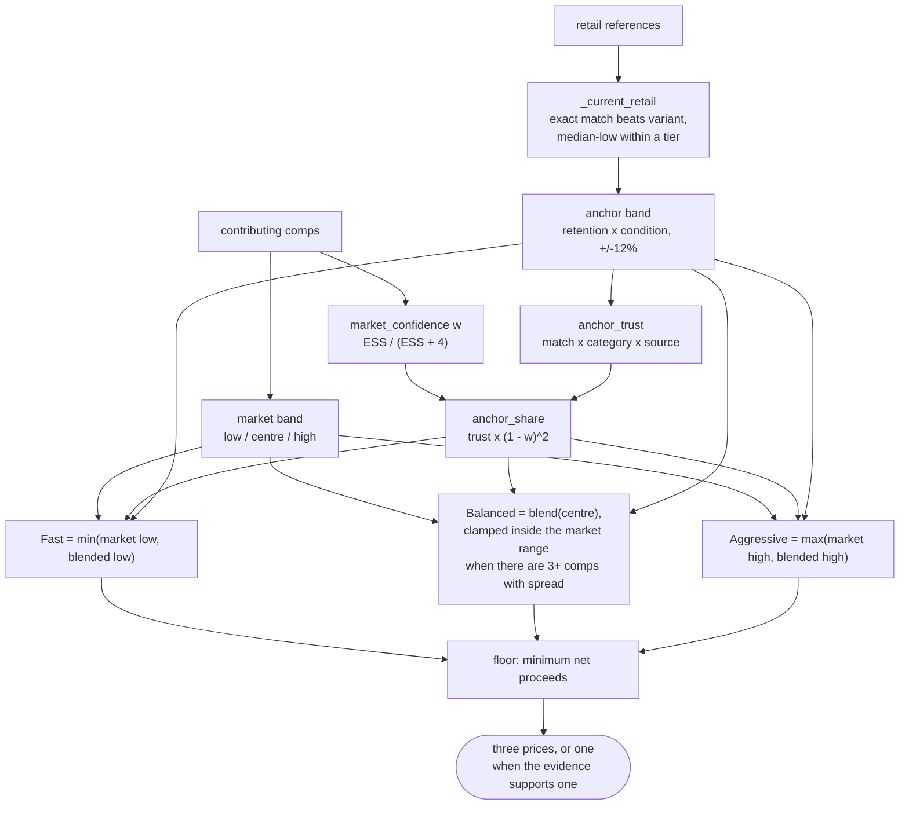

# Pricing

What the system knows about what a thing is worth, and how it turns that into
three numbers a seller can choose between.

All of `src/resell/pricing/` is pure: no database, no network. It takes a
`PricingInput` and returns a `PriceRecommendation`, which is why a price can be
reproduced from stored rows months later.

## Two kinds of evidence, kept apart

| | question it answers | where it lives |
|---|---|---|
| **Marketplace evidence** | what strangers ask or get for used ones | `comp_observation` → `comp_claim` |
| **Retail evidence** | what one costs new, from someone entitled to sell it new | `retail_observation` → `retail_claim` |

They never mix. A retail price has never entered a distribution — `summarize()`
raises on `PriceKind.REFERENCE` — and since the retail tables exist,
`load_scored_comps()` cannot reach a shop price at all.

The two meet only at the end, as weights.

## The comparability ladder

Every marketplace listing is graded by the comp judge:

| rung | meaning | contributes |
|---|---|---|
| `same_product` | the identical product | yes |
| `same_family_variant` | same line, different variant, colour or year | yes |
| `category_attribute` | the same kind of thing, comparable attributes | yes |
| `superficial` | it merely resembles it | retained, counts for nothing |
| `excluded` | must not count; the reason is required | no |

An item whose identity was never resolved has its ladder **capped** at
`same_family_variant`; `record_comp_claim()` enforces that against the stored
identity resolution, so a `same_product` judgement on an unresolved item is
refused whatever the prompt said.

## Market confidence

One continuous number, `market_confidence`, replacing what used to be a
threshold. It answers: how much of the answer does this sample deserve?

**Quality scales the count, not the result.** Each observation is worth `quality`
of an observation; the weighted total is an effective sample size, and confidence
saturates in that:

```
quality = rung x kind x condition x identity
ESS     = sum(quality) over contributing comps
w       = ESS / (ESS + 4)
```

| factor | values |
|---|---|
| rung | `same_product` 1.00 · `same_family_variant` 0.75 · `category_attribute` 0.50 |
| kind | realized 1.00 · asking 0.85 |
| condition | matched 1.00 · adjacent 0.90 · unknown or ≥2 ladder steps 0.70 |
| identity | resolved 1.00 · unresolved 0.85 |

The alternative — multiplying a breadth term by the quality factors — puts a
ceiling on confidence that no amount of data can lift. Sibling asks of unknown
condition on an unresolved item cap out at 0.38, so twenty real listings would
still hand a retail inference 47% of the say. Twenty listings are a market. The
effective-sample form says they are worth about 7.6 solid comps, which is the
honest version of the same doubt, and it is identical to the simple form when
quality is perfect.

## The retail-derived anchor

A shop price is not a comparable sale and never joins a sample. What a person
does with one instead is reason down from it: a thing worth $229 new is worth
some fraction of that second-hand, and the fraction depends on what kind of thing
it is.

`src/resell/pricing/retention.py` states that fraction per eBay top-level
category and per condition. The numbers are informed defaults, stated in one
place so that changing an opinion about how backpacks hold their value is a
one-line diff with a name on it. When there are enough realized sales to measure
retention per category, measurement should replace them.

The anchor is a **band**, not a number — ±12% either side — because it is
inferred and should not present as a measurement.

### Which shop prices may anchor

Two separate doubts, kept separate.

**Is this a real retail price?** — `retail_reading.is_retail_source()`. A maker's
own site qualifies by brand-matching the host (`bowflex.com` for a Bowflex), or
by the authority table. Resellers such as Amazon are excluded: one page carries
the retailer's new price and third-party offers of every condition. An unknown
host is fetched and must then prove itself.

**Is it a price for *this* thing?** — the judge, producing
`RetailReference.match`. Only `same_product` and `same_family_variant` may
anchor, deliberately tighter than `Comparability.contributes`: a comp one rung
down still says something about this market, while a shop price one rung down is
another product's price tag. MP-000022 is why — nine current prices off
bowflex.com, six of which the judge excluded, and taking the lowest of them
anchored a $399 pair of dumbbells on a $29.99 tablet holder.

### Page-level qualification for unknown shops

An unknown host substitutes proof for reputation. `validate_product_page()`
requires **all** of: a single-product URL shape · a `schema.org/Product` with an
offer · exactly one product name · a stated price and currency · a brand match ·
a purchase affordance. No model call is involved — the site's machine-readable
claim is the extraction.

### Source trust

`anchor_trust` multiplies three separable doubts:

```
anchor_trust = match x category x source
```

| source | factor |
|---|---|
| the maker's own site | 1.00 |
| a registered authorised retailer | 0.90 |
| unknown, page-validated | 0.60 |
| anything else | 0 — ineligible |

`category` is 1.00 when the retention table has a rate for the item's top-level
grouping and 0.75 when it falls back to the default.

## Combining them



**The square is the design.** Linear in `1 - w` gives twenty exact comps a 29%
retail share, which pushes a recommendation above every listing anybody can see.
Squared it is 8.5%, and with realized sales under 3%: a strong market dominates
without a threshold saying so, and a weak one lets the anchor speak in
proportion.

### Three asymmetries

These are seller intents, not statistics of one sample.

- **Fast never rises above the market floor.** A "sell quickly" price above every
  visible competitor does not sell quickly. Retail can lower it — when there is
  no market at all it is all there is — and cannot lift it.
- **Balanced is capped by the market's ceiling** whenever the sample has one.
  Balanced means the price most likely to actually sell; recommending above every
  observed seller is the other strategy's job. Below three comps there is no
  ceiling to speak of: one listing is a fact about one seller.
- **Aggressive may exceed the market**, in proportion to what the marketplace
  evidence is missing.

Two clamps keep the two kinds of evidence honest about each other. The anchor may
not drag the centre **below** every observed price — it is a depreciation
estimate, and transactions above it falsify the retention rate rather than the
other way round. And it may not push the centre **above** a market with a real
ceiling, for the mirror-image reason.

**No spacing is manufactured.** Where the evidence supports one number, the three
stay together and the screen shows one price.

## Worked examples

Computed with the real code. The anchor throughout is a **$399** current shop
price at the default retention rate, `used_good` — a band of
$130.62 / $148.43 / $166.24. Reproduce them with `scripts/verify_pricing_cases.py`.

| evidence | w | anchor share | Fast | Balanced | Aggressive |
|---|---|---|---|---|---|
| 3 sibling asks $45/$99.99/$99.99, + retail | 0.221 | 0.455 | $45.00 | $99.99 | $130.11 |
| 20 exact asks $90–$105, + retail | 0.783 | 0.035 | $90.00 | $99.30 | $103.54 |
| 20 exact **realized** $90–$105, + retail | 0.810 | 0.027 | $90.00 | $98.89 | $103.02 |
| no comps at all, + retail | 0.000 | 1.000 | $130.62 | $148.43 | $166.24 |
| one exact comp $120, + retail | 0.153 | 0.538 | $120.00 | $135.30 | $144.88 |
| 3 sibling asks, **no** retail | 0.221 | 0.000 | $45.00 | $99.99 | $99.99 |

The last row is the no-manufactured-spacing case: two strategies coincide and the
seller is shown one price.

## What a price records

`price_proposal` keeps the band, the qualifiers, the frozen comp set and its
hash, the fee schedule version, and — as of the observability change —
`market_confidence`, `anchor_weight` and all three `strategy_prices_json`. None
of those three is read back into a decision; `content_hash()` ignores them, so
capturing them cannot change what a proposal *is*.

## Known limits

- **The retention table is opinion, not measurement.** It has no `Health &
  Beauty` row, so massagers use the default rate.
- **Retail is a single point.** Two shops disagreeing is not modelled beyond
  preferring an exact match and then the lower-middle of a tier.
- **Condition adjustments are not applied to an anchored price**, because
  condition is already inside the retention factor. Applying both would count
  the same fact twice.
