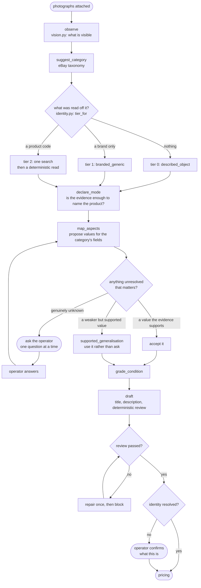
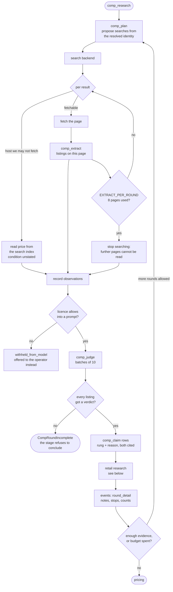
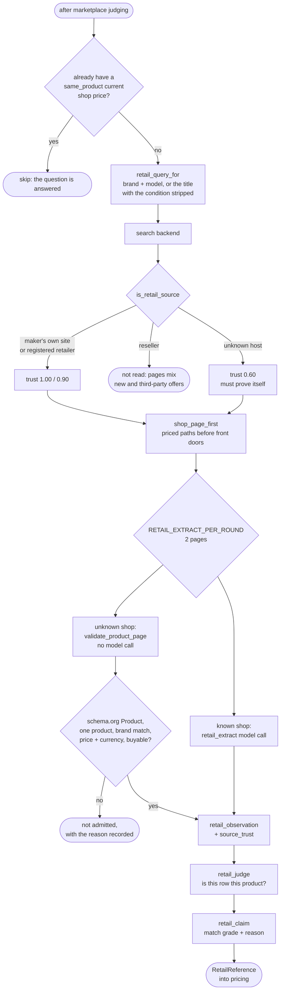

# Research and evidence

How the agent finds things out, what it is allowed to believe, and what it does
with the things it decides not to believe.

The rule everything follows from: **the agent may believe nothing it cannot
cite.** Every claim about an item traces to a row in `evidence` recording what
was seen, where, and on what basis.

## Evidence

| column | meaning |
|---|---|
| `subject` | `this_item` — the physical thing on the table — or `candidate_product`, a product on a page that may or may not be it |
| `basis` | `visual_observation`, `text_read`, `external_source`, `inference`, `operator` |
| `source_excerpt` | the page's own words, verbatim. An extraction whose quotation is not in the page is discarded |
| `send_to_model` | whether licensing permits this row into a prompt |

The `subject` split is the load-bearing one. A fact read off a candidate product
page is a fact *about that page's product*, not about the item, until something
promotes it. `record_candidate_facts()` fixes `subject` to `candidate_product`
rather than accepting it as a parameter, because a retrieval path that could
write `this_item` evidence would bypass the whole promotion gate.

### The donation gate

`donation_scope()` decides how much a candidate product may lend to the item's
identity, from two inputs: how firmly the candidate is tied to the item
(`MatchStrength`) and how authoritative the page is (`SourceAuthority`). An
unknown domain ranks zero and donates nothing at any match strength.

`authority.py` is an allowlist and fails closed. A genuine manufacturer
contributes nothing until somebody adds it — which is the right way round,
because the alternative guesses upward and silently widens what an unfamiliar
page may assert about an object nobody has photographed carefully.

## Identification

Three behaviours worth knowing:

**Identification is deterministic and spends no model call.** It used to be three
— a planner, a per-page reader and a matcher. Across 57 items those ran 97 times
for $2.73, performed 37 lookups, wrote 22 `product_match` rows of which **none**
was a match, and never once resolved an identity. The half that worked was the
deterministic half, so that is all that is left.

What the tier decides is whether there is anything external worth asking about. A
brand alone is a query that returns the catalogue rather than this object, so
tiers 0 and 1 conclude without searching; `described_object` is the right answer
for most household objects and is a conclusion, not a failure. Tier 2 asks the one
question an identifier cannot answer about itself — *which product does this code
denote?* — with a single static query, and reads the results by string comparison
and source authority. No page is fetched and no model is consulted.

**Exact resolution is not shipped, and fails closed.** A tier-2 search runs, and
records every source that named the identifier and what a corroboration rule would
have made of them — but nothing it finds lifts the comparability ceiling above
`same_family_variant`. That rule was replayed against all 54 historical items with
usable observations: it resolved 13 and **six were wrong**, including a Brooks
Brothers suit jacket resolved as a Barmesa submersible sewage pump by three
independent plumbing suppliers. `RESOLVED` is a pricing decision — it lifts comps
to `same_product` — and it is not one to make on a 46% error rate.

The hold costs nothing. The LLM research system this replaced resolved 0 of 57
items over the project's life, so `same_family_variant` is exactly where the
ceiling already was. `EXACT_RESOLUTION_SHIPPED` in
[identity.py](../src/resell/reasoning/identity.py) carries the full account, and
[tests/fixtures/identity_replay_cases.py](../tests/fixtures/identity_replay_cases.py)
keeps the real search results for the cases that defeated it, so the next rule is
designed against them rather than against invented ones.

**Questions are a last resort.** `gaps.py` first tries `value_appears_in()` —
casefolded matching, a small synonym table, spelling normalisation
(grey/gray, colour/color) — and then `supported_generalisation()`, which will use
a weaker allowed value the evidence does support rather than ask. On the item
that motivated this, four blocking questions became one.

**Identification versions are superseded, not edited.** Every stage that changes
a belief writes a new `identification` row through `merged_identification()`,
which carries forward everything it was not asked to change. There is exactly one
such merge function on purpose: a second, hand-rolled copy of it once dropped
`category_path` from every item, and the loss was invisible until pricing.

## Comp research

One round is: plan → search → fetch → extract → judge → claim. Rounds repeat
while the budget allows and the evidence is thin.

### The invariant this stage exists to protect

*"Set a price yourself" is a statement about the market: we looked, and there is
not enough to price from. It must never be what a technical stop turns into.*

A round that did not finish judging raises `CompRoundIncomplete` rather than
concluding. One item retrieved 38 listings, judged 30, lost every verdict to a
budget check on the 31st, and asked its owner to name a price as though the
market had been searched and found wanting. `advance()` retries within its bound
and then blocks, which is visible and can be retried; what it cannot do is close
the stage and route to a decision claiming knowledge the round never obtained.

### Three budgets, three units

| | counts | bounds |
|---|---|---|
| **rounds** | `comp_plan` calls, one per round | how many times the loop may go round |
| **breadth** | searches per round, pages per round (`EXTRACT_PER_ROUND = 8`), listings per judging batch (`JUDGE_BATCH = 10`) | how far one round may fan out |
| **money** | `max_cost_micros` across every physical call | the item's real ceiling |

Breadth keeps a round affordable; money keeps the item affordable. Batching is
the scalability guarantee — a listing is judged exactly once per round however
many batches that takes, and every physical batch is ledgered.

## Retail research

A second, separate evidence objective added because the comp extractor is told it
is reading *"one marketplace page"* and listing *"the individual listings it
shows"* — and a shop selling one product new is not that. On the item that
exposed it, eight extractions went to shop pages and produced nothing, while a
page carrying the answer sat unread.

Discovery is deliberately narrow: one targeted query, and only while the answer
is unknown. A shop price does not change between two rounds of one run.

The retail budget is separate from the marketplace budget so that a shop page can
never again consume an extraction the resale market needed.

## Judging

The comp judge works through an ordered test and stops at the first line that
applies:

1. **Is the sale unit larger than the product?** Count primary units and
   separately valuable optional products, not parts. A charger, cable, case,
   manual or standard attachment set is what the thing ships with, not a second
   product. Separate availability is explicitly not the test — nearly every
   accessory is also sold as a replacement. Where a listing is ambiguous, that is
   a **rung** question, not an exclusion.
2. **A different material or cloth?**
3. **A different kind of object?** An accessory, a part, a lot.
4. **Otherwise** it is the same object in a different version, and a different
   fit, cut, sub-line or diffusion line is a step down the ladder rather than an
   exclusion.

Every exclusion carries its reason; a reasonless exclusion is refused on the way
in, because a listing neither counted nor accounted for is the one outcome worse
than either judging it or excluding it.

**Prompt behaviour is measured, not asserted.** Both previous versions of rule 1
passed their tests while the live judge did the opposite.
`scripts/rejudge_mp000047.py` re-runs the real judge against ten stored listings,
and `tests/test_comp_judge_bundles.py` records what it actually returned.

## Failure handling

- A stage that raises is retried once (`STAGE_ATTEMPTS = 2`), unless the
  exception is an answer rather than an accident — a refusal or an exhausted
  budget, which a second identical attempt would only pay to rediscover.
- A stage that fails twice **blocks** the run: the step stays owed, the item does
  not move, and the seller is offered "Try again".
- A model response that is truncated (`stop_reason == "max_tokens"`) is treated
  as an incomplete judgement, never as an empty valid one.
- Partial results are kept. A budget stop mid-round preserves everything already
  retrieved and judged.
